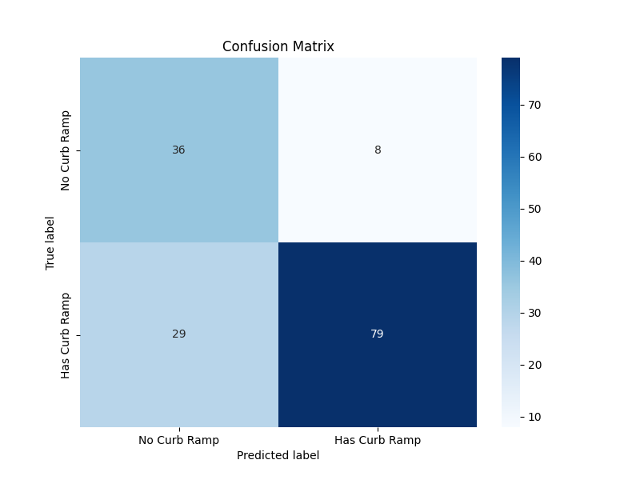

# Detecting curb ramps with GPT Vision and the Microsoft Semantic Kernel

Our goal is to detect whether a street image, such as images detected by Google Street View or Bing Streetside, contains a curb ramp.

A curb ramp is an inclined plane installed at or across a curb to allow easy access over the curb for wheelchairs, strollers, bicycles, and other wheeled objects. Curb ramps are typically found at intersections, pedestrian crossings, and other locations where it's necessary to facilitate the transition from the sidewalk to the street level.

Curb ramps are an essential component of urban infrastructure, ensuring accessibility for all and complying with regulations such as the Americans with Disabilities Act (ADA) in the United States.

![]

