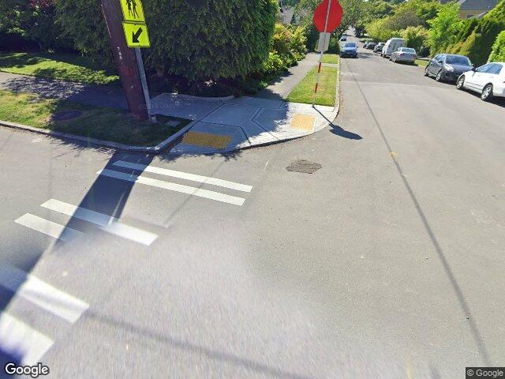
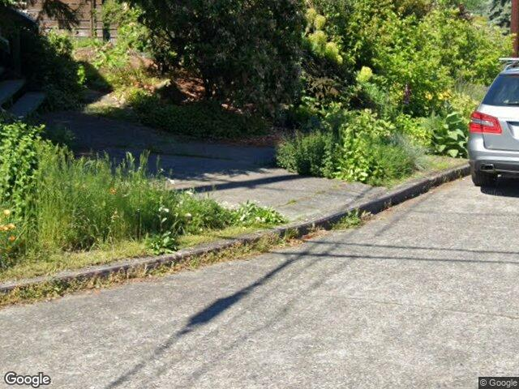

# Detecting curb ramps with GPT Vision and the Microsoft Semantic Kernel

Our goal is to detect whether a street image, such as images detected by Google Street View or Bing Streetside, contains a curb ramp.

A curb ramp is an inclined plane installed at or across a curb to allow easy access over the curb for wheelchairs, strollers, bicycles, and other wheeled objects. Curb ramps are typically found at intersections, pedestrian crossings, and other locations where it's necessary to facilitate the transition from the sidewalk to the street level.

Curb ramps are an essential component of urban infrastructure, ensuring accessibility for all and complying with regulations such as the Americans with Disabilities Act (ADA) in the United States.

Here's an example of an image with a curb ramp


Here's an example with an image without a curb ramp


We used the [Vision plugin](https://github.com/lucas-a-meyer/sk-vision-py) for the [Microsoft Semantic Kernel](https://github.com/microsoft/semantic-kernel/). The Vision plugin provides a simple interface to the [GPT Vision API](https://platform.openai.com/docs/guides/vision).

We apply the code to 200 images that were manually classified, 100 images with curb ramps and 100 images without curb ramps, using the code below:

```python
    kernel = sk.Kernel()
    vision = kernel.import_skill(Vision())
    prompt = "Does this image have a curb ramp? Respond only with 'y' if it does or 'n' if it does not.\n"
    url = "" # image url

    variables = sk.ContextVariables()
    variables['prompt'] = prompt
    variables['url'] = url        

    has_ramp = await kernel.run_async(vision['ApplyPromptToImage'], input_vars=variables)
```

The approach works somewhat well for identifying curb ramps in pictures that have one (87%), but the overall accuracy is somewhat low, at 66.5%.

The confusion matrix is below.


# Next steps

It's likely that higher resolution images will perform a lot better without any additional changes. We may also try to create a computer vision model to help the OpenAI Vision API.

[ ] Add Kayla to GitHub
[ ] Get images from Bing Streetside
[ ] Get higher-resolution images from Google Street View
[ ] Check if the model provides a probability value
[ ] Experiment with prompt engineering
[ ] Get different types of images from Google Street View (pano, fish-eye, etc.)
[ ] Get same set of images in several different configurations (Bing, Google, pano, fish-eye) 


